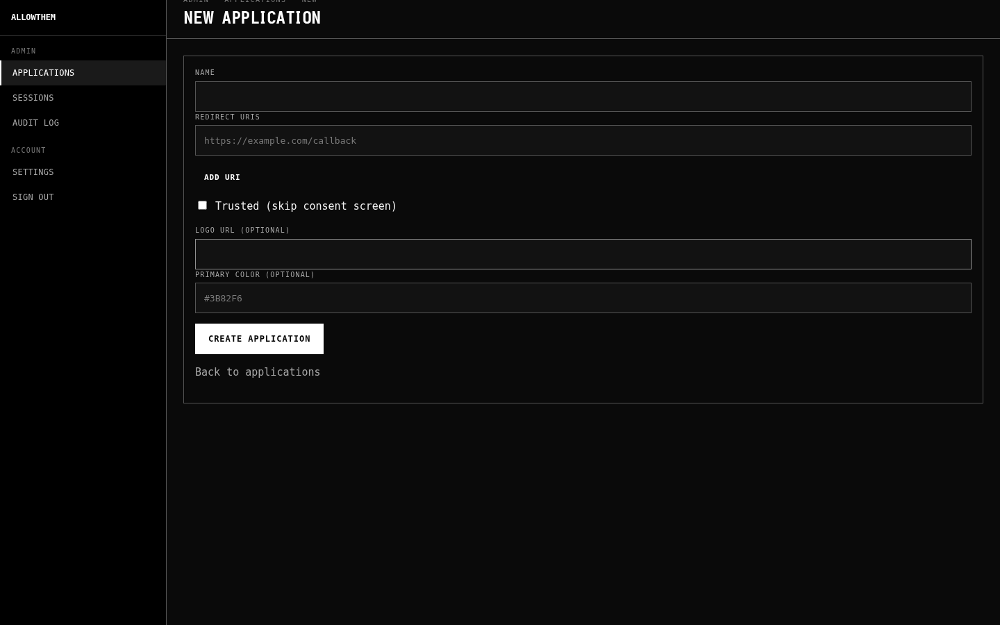

# allowthem

An embeddable authentication system for Rust applications. Use it as a library within your Axum app or run it as a standalone auth service with OIDC provider capabilities.

## Modes

**Embedded (library):** Add `allowthem-core` as a dependency, pass your `SqlitePool`, and allowthem manages auth tables in your database (prefixed with `allowthem_` to avoid collisions). Your app calls the API directly for registration, login, session management, and access control.

**Standalone (service):** A self-contained binary with its own database, server-rendered UI, and REST/OIDC endpoints. Functions as a self-hosted identity provider -- external applications authenticate via standard OpenID Connect flows.

Both modes expose the same `AuthClient` trait. Consuming projects code against this trait and can switch between embedded and standalone with a configuration change, no code modifications required.

## Features

- Email + password registration and login (Argon2id hashing)
- Session-based authentication with configurable TTL and sliding-window renewal
- CSRF protection (double-submit cookie pattern)
- Generic roles and permissions (integrator-defined, no enforced hierarchy)
- Audit logging
- JWT generation and validation (HS256 for embedded, RS256 for OIDC)
- Persistent API tokens with bearer authentication
- Password reset flow with time-limited tokens
- OAuth2 login (Google, GitHub) with account linking
- TOTP-based MFA with recovery codes

## Tech Stack

- **Web framework:** Axum
- **Database:** SQLite via SQLx
- **Async runtime:** Tokio
- **Rust toolchain:** nightly (pinned in `rust-toolchain.toml`)

## Project Structure

```
crates/
  core/       # Types, database, auth logic, migrations
  server/     # HTTP routes, middleware, extractors
binaries/     # Standalone server entry point
```

## Quick Start

### Prerequisites

[Nix](https://nixos.org/) with flakes enabled, or the Rust toolchain specified in `rust-toolchain.toml`.

### Build and Test

```sh
just build    # cargo build --workspace
just test     # cargo test --workspace
just check    # cargo check --workspace
just clippy   # cargo clippy --workspace -- -D warnings
```

### Embedded Usage

```rust
use allowthem_core::{AllowThemBuilder, AuthClient};

let auth = AllowThemBuilder::new()
    .with_pool(pool)
    .session_ttl(Duration::from_secs(86400))
    .cookie_name("session")
    .build()
    .await?;
```

The builder accepts configuration for session TTL, cookie name/domain/security, and MFA encryption keys. Once built, the `AllowThem` handle provides methods for user management, session lifecycle, roles, permissions, and token operations.

## Branding

Every page allowthem renders — auth pages (login, register, MFA, consent) and admin pages (applications, users, sessions, audit log) — threads per-application branding through a shared CSS custom property layer. Tenants get their own logo, accent color, forced mode, webfont, and splash visual without the integrator templating anything by hand. Branding is resolved server-side per request and emitted into the page's `<style>` block, so the first paint is already branded.

### Branding fields

Each field lives on the `allowthem_applications` row and is populated via `CreateApplicationParams` / `UpdateApplication`. All fields except the application name are optional; unset fields fall back to safe defaults or derived values.

| Field | Type | Default | Purpose |
|---|---|---|---|
| `name` | `String` | required | Application label; surfaces in the auth shell eyebrow and consent screen. |
| `logo_url` | `Option<String>` | none | Logo rendered in the auth shell header. |
| `primary_color` | `Option<String>` | none | Legacy; superseded by `accent_hex`. |
| `accent_hex` | `Option<String>` | `#ffffff` | Drives `--accent` and its derived tokens (`--accent-hover`, `--accent-press`, `--accent-ring`). |
| `accent_ink` | `Option<AccentInk>` | derived | Text color on accent fills (`"black"` or `"white"`). Derivation falls back to a YIQ threshold (160) when unset. |
| `forced_mode` | `Option<Mode>` | none | `"light"` or `"dark"` — locks `<html data-mode>` and hides the mode toggle. |
| `font_css_url`, `font_family` | `Option<String>` | none | Optional webfont; the URL is loaded via `<link>` and `font_family` becomes the `--font-body` CSS var. |
| `splash_text` | `Option<String>` | none | Fallback text rendered on the auth shell's splash aside. |
| `splash_image_url` | `Option<String>` | none | Raster splash image. Takes priority over primitive + text. |
| `splash_primitive` | `Option<SplashPrimitive>` | none | One of `wordmark`, `circle`, `grid`, `wave`. Chosen when `splash_image_url` is unset. |
| `splash_url` | `Option<String>` | none | Paired with `splash_primitive` when the primitive needs external data. |
| `shader_cell_scale` | `Option<i64>` | none | Cell scale for the `wave`/`grid` primitive. |

Splash priority order (highest first): `splash_image_url` > `splash_primitive` > `splash_text`.

### Setting branding per tenant

**Embedded mode:** integrators call `Db::create_application` directly. The returned `Application` carries the generated `client_id`.

```rust
use allowthem_core::applications::CreateApplicationParams;
use allowthem_core::{AccentInk, ClientType};

let (app, _secret) = ath
    .db()
    .create_application(CreateApplicationParams {
        name: "Acme".into(),
        client_type: ClientType::Confidential,
        redirect_uris: vec!["https://acme.example.com/callback".into()],
        is_trusted: false,
        created_by: None,
        logo_url: Some("https://acme.example.com/logo.svg".into()),
        primary_color: None,
        accent_hex: Some("#cba6f7".into()),
        accent_ink: Some(AccentInk::Black),
        forced_mode: None,
        font_css_url: None,
        font_family: None,
        splash_text: Some("Welcome to Acme".into()),
        splash_image_url: None,
        splash_primitive: None,
        splash_url: None,
        shader_cell_scale: None,
    })
    .await?;
```

**Standalone mode:** the admin UI exposes `/admin/applications/new` for creation and `/admin/applications/:id/edit` for edits. Every branding field is a form input on those pages; no SQL editing is required.



### Accent ink derivation

When `accent_ink` is unset, allowthem computes it via a YIQ luminance check on `accent_hex` with a threshold of 160: values above the threshold get black ink, everything else gets white. The single source of truth is `allowthem_server::branding::derive_ink` — unit tests lock the threshold. Set `accent_ink` explicitly if your brand guide mandates a specific ink that the derivation would flip.

### Forced mode

`forced_mode` pins the page to light or dark regardless of the user's system preference or saved toggle state. When set, the server emits `<html data-mode="light" data-mode-locked>` (or dark), the FOUC-free bootstrap skips localStorage, and the mode toggle is hidden from the sidebar.

### Custom fonts

`font_css_url` is loaded as a `<link rel="stylesheet">` before the allowthem kit CSS; `font_family` is applied to `--font-body`. Both must be set together for the override to take effect. Font loading is gated by the integrator's CSP — self-host or whitelist the font host as needed.

### Splash

The auth shell renders a splash aside beside the login/register form. `splash_image_url` wins if present; otherwise `splash_primitive` renders one of four generative visuals (`wordmark`, `circle`, `grid`, `wave`), with `splash_url` and `shader_cell_scale` as primitive inputs where applicable; otherwise `splash_text` renders plain text. None set → the shell falls back to the application name.

## License

MIT OR Apache-2.0
